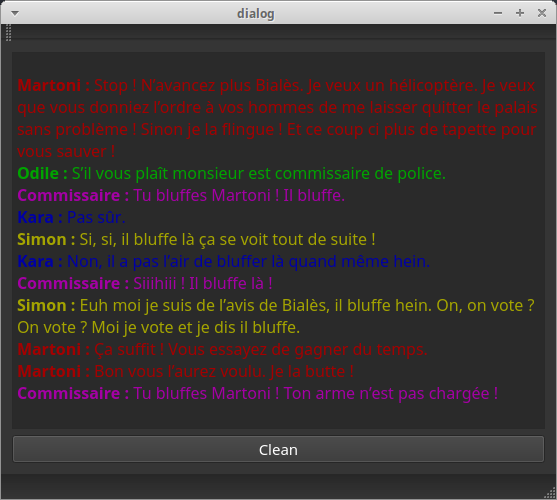

# dialoGUI

This project is a graphical user interface (GUI) for ROS that allows you to display dialog (or other) messages provided by multiple topics.

## Usage

To use it, simply overload the launch file provided in the launch folder.

```xml
<launch>

  <include file="$(find dialogui)/launch/dialoGUI.launch">
    <arg name="name" default="my_dialog_window" />
  	<arg name="ids" default="id_1
                             id_2" />
  	<arg name="topics" default="id_1_topic
                                id_2_topic" />
  </include>

</launch>
```
You can specify as many identifiers and topics as you want as long as you have as many topics as identifiers.

Each subject to which you want to connect **must be of type std_msgs/String**.

The name Arg define the title of your window.

## Test it

To test the GUI, we provide a very simple program that will display a short dialog.

Run the dialoGUI:
```
$ roslaunch dialogui dialoGUI.launch
```

On an other window, run the test:
```
$ rosrun dialogui test_diag
```

## Preview

Once you have run the test program, you should have the window below. Each topics is in a different color and the identifier of each topics is displayed in bold just before the message.



## Troubles

If you have the following error :

```
 Could not find a package configuration file provided by "qt_build" with any of the following names:

    qt_buildConfig.cmake
    qt_build-config.cmake
```

You just have to install qt-build:
```
$ sudo apt-get install ros-kinetic-qt-build
```
